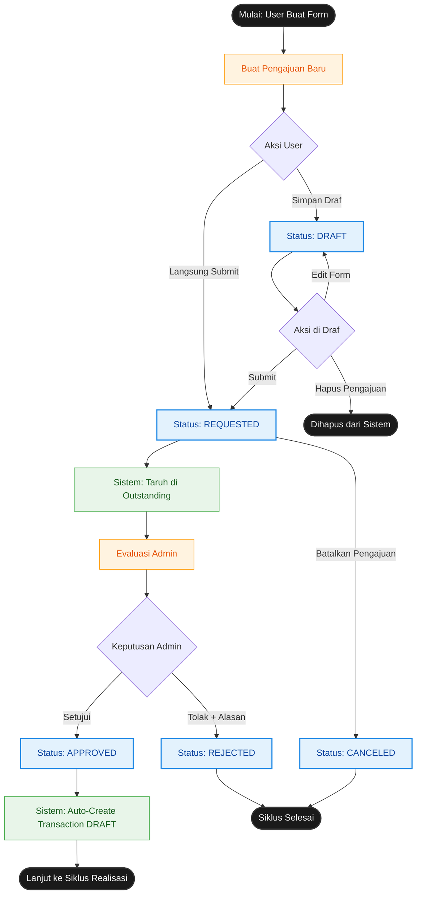

# Core Flowcharts - Sistem Keuangan Keluarga

Dokumen ini berisi standar Flowchart *Core Business Logic* menggunakan sintaks **Mermaid**, yang disusun secara **100% akurat** berdasarkan arsitektur struktur database dan rule pada controller aplikasi `Sistem Keuangan Keluarga`.

---

## 1. Siklus Pengajuan & Approval (`RequestHeader`)

Diagram ini memvisualisasikan perjalanan siklus hidup *Header Pengajuan* (`request_header`), mulai dari draf awal hingga tahap keputusan akhir (Approved/Rejected/Canceled). Diagram ini secara ketat membedakan aksi yang bisa dilakukan berdasarkan status saat ini.



---

## 2. Siklus Realisasi, Saldo & Outstanding (`TransactionHeader` + `Balance`)

Diagram ini menggambarkan alur pencairan dana (`transaction_header`) yang mengikat langsung pada Engine Saldo (`balances`), serta bagaimana siklus Realisasi Parsial (Outstanding) ditangani menggunakan integrasi `request_detail`.

```mermaid
graph TD
    %% Styling
    classDef startEnd fill:#1A1A1A,color:#fff,stroke:#333,stroke-width:2px;
    classDef status fill:#E3F2FD,color:#0D47A1,stroke:#1E88E5,stroke-width:2px;
    classDef action fill:#FFF3E0,color:#E65100,stroke:#FF9800,stroke-width:1px;
    classDef system fill:#FFF8E1,color:#F57F17,stroke:#FBC02D,stroke-width:2px;
    classDef detail fill:#FCE4EC,color:#880E4F,stroke:#D81B60,stroke-width:1px;
    
    %% Nodes
    S_IN1([Mulai: Via Auto-Create Approval]):::startEnd --> S_DRAFT
    S_IN2([Mulai: Pencatatan Kas Manual]):::startEnd --> S_DRAFT
    S_IN3([Mulai: Via Cairkan Sisa (Partial)]):::startEnd --> S_DRAFT
    
    S_DRAFT[Status Transaksi: DRAFT]:::status --> A{Aksi Transaksi}
    
    %% Dari Draft
    A -- "Hapus Draf" --> DEL[Sistem: Kembalikan Pengajuan ke Requested]:::system
    A -- "Cairkan Dana" --> S_COMP[Status Transaksi: COMPLETED]:::status
    
    %% Action saat Completed
    S_COMP --> B_BAL[Engine: Update Saldo Balance Bulan Ini]:::system
    B_BAL --> B_DET[Update Detail Pengajuan -> REALIZED]:::detail
    
    %% Cek Sisa Outstanding
    B_DET --> C{Ada Sisa Outstanding?}
    
    %% Realisasi Parsial Loop
    C -- "Ya, Nominal Kurang / Item Pending" --> P_ACTION{Aksi Admin thd Sisa}
    P_ACTION -- "Cairkan Sisa" --> S_IN3
    P_ACTION -- "Batalkan Sisa (Write-off)" --> W_OFF[Sistem: Set Detail -> CLOSED]:::detail
    W_OFF --> END([Siklus Selesai]):::startEnd
    
    %% Beres
    C -- "Tidak (Dana Full Tercairkan)" --> END
    
    %% Revert / Cancel Pencairan
    S_COMP -.-> |Batalkan Pencairan| REV[Admin Revert ke Draf]:::action
    REV -.-> REV_BAL[Engine: Kembalikan Saldo]:::system
    REV_BAL -.-> S_DRAFT
```
