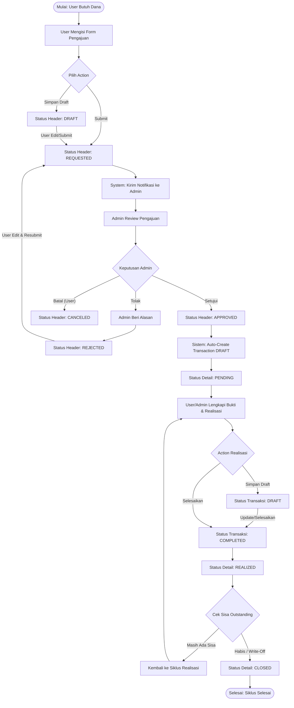

# Flowchart Sistem Keuangan Keluarga

Dokumen ini berisi standar Flowchart menggunakan sintaks **Mermaid**. Anda bisa me-*render* kode di bawah ini menjadi gambar di [Mermaid Live Editor](https://mermaid.live/) atau ekstensi Markdown VS Code Anda, lalu menyimpannya dalam format **PDF** untuk dikumpulkan ke Perusahaan.

## 1. Flowchart Arus Kas Keluar & Siklus Pengajuan (Core Approval Workflow)

Diagram ini mengilustrasikan perjalanan dana dari sejak diminta (Pengajuan) hingga dana tersebut dibelanjakan dengan bukti (Realisasi/Pengeluaran).



---

## 2. Flowchart Otentikasi, Hak Akses (Privasi), dan Kas Masuk

Diagram ini memvisualisasikan bagaimana sistem secara ketat membelah akses antara `Admin` dan `User` biasa, serta bagaimana Admin mengontrol suntikan Kas Masuk (Income) yang jadi *trigger* awal saldo Dashboard.

```mermaid
graph TD
    %% Nodes
    Start([Mulai: Login Aplikasi]) --> A
    A[Email & Password di-submit] --> B{Validasi Autentikasi}
    
    B -- Gagal --> C[Kembali ke Halaman Login]
    B -- Valid --> D{Cek Role Middleware}
    
    %% Alur User Biasa
    D -- Role: USER --> E[Menerapkan Scoped Visibility: user_id]
    E --> F[Memuat Dashboard Personal]
    F --> |Hanya Boleh| G(Mengakses Data Miliknya Sendiri)
    
    %% Alur Admin Utama
    D -- Role: ADMIN --> H[Menerapkan Global Visibility]
    H --> I[Memuat Dashboard Global Keluarga]
    I --> J{Pilih Task Utama Admin}
    
    J -- Approver --> K[Daftar Seluruh Pengajuan Menunggu]
    J -- Controller --> L[Input Kas Masuk Baru]
    
    %% Alur Kas Masuk
    L --> M[Form Pendapatan/Bonus/Gaji]
    M --> N{Submit Form}
    N --> O[Sistem: Tambah Saldo Akhir]
    O --> P[Update Diagram Pemasukan Dashboard]
    P --> ([Selesai])
```
