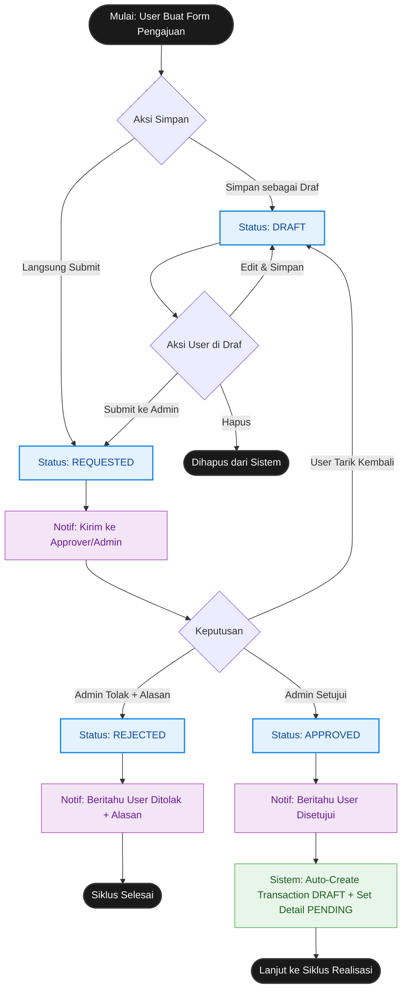
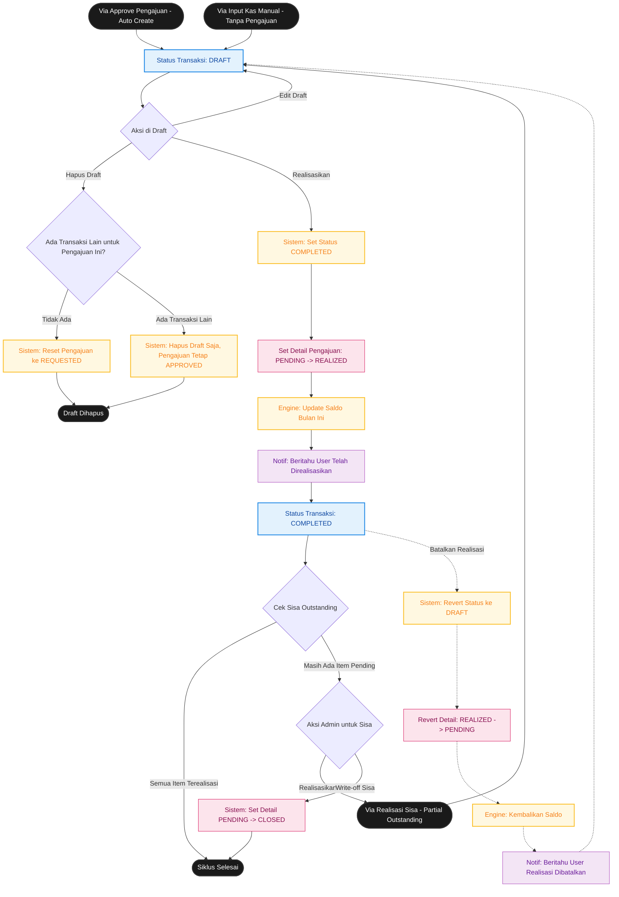

# Core Flowcharts - Sistem Keuangan Keluarga

Dokumen ini berisi standar Flowchart *Core Business Logic* menggunakan sintaks **Mermaid**, yang disusun secara **100% akurat** berdasarkan kode di `app/Services/`, `app/Http/Controllers/Transaction/`, dan skema database (`database/migrations/`).

> Render diagram di [Mermaid Live Editor](https://mermaid.live/) atau ekstensi Markdown VS Code, lalu export ke **PDF** untuk dikumpulkan.

---

## 1. Siklus Pengajuan & Approval

Model: `request_header` | Service: `FinanceRequestService`

Diagram ini memvisualisasikan perjalanan siklus hidup Pengajuan (`request_header`), mulai dari pembuatan form hingga keputusan final (Approved / Rejected). User bisa menarik kembali pengajuan ke Draft kapan saja sebelum diproses Admin.

---

## 2. Siklus Realisasi, Saldo & Outstanding

Model: `transaction_header` + `request_detail` | Service: `TransactionService` + `BalanceService`

Diagram ini menggambarkan alur realisasi transaksi, update saldo, dan penanganan outstanding (realisasi parsial) termasuk write-off.

